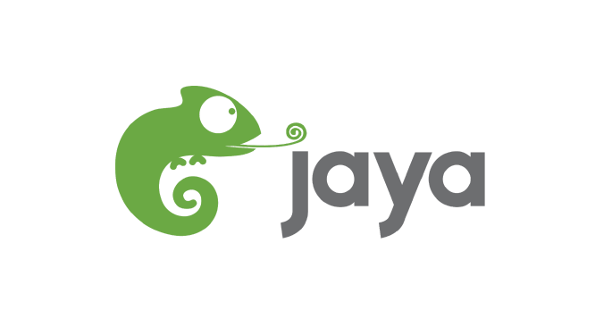
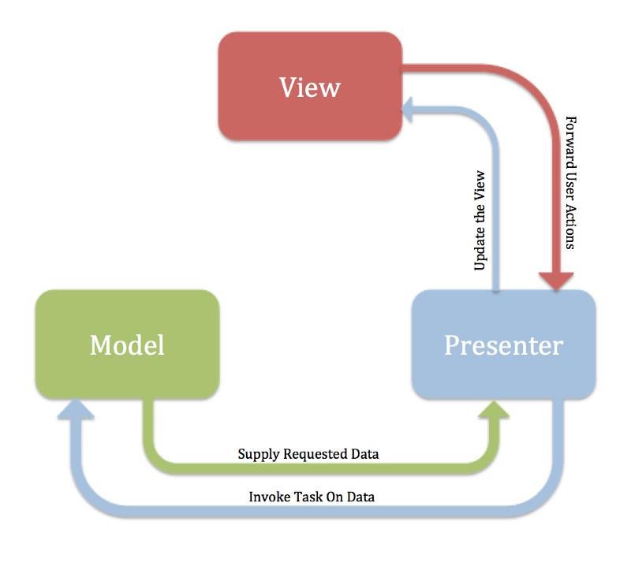
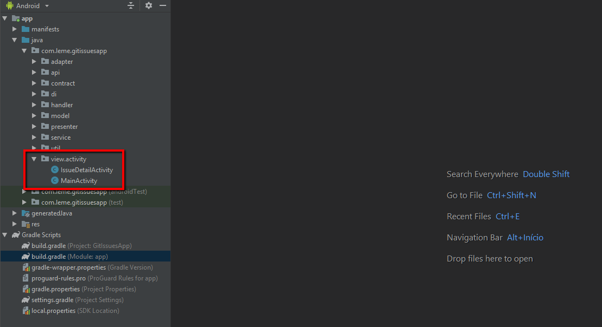
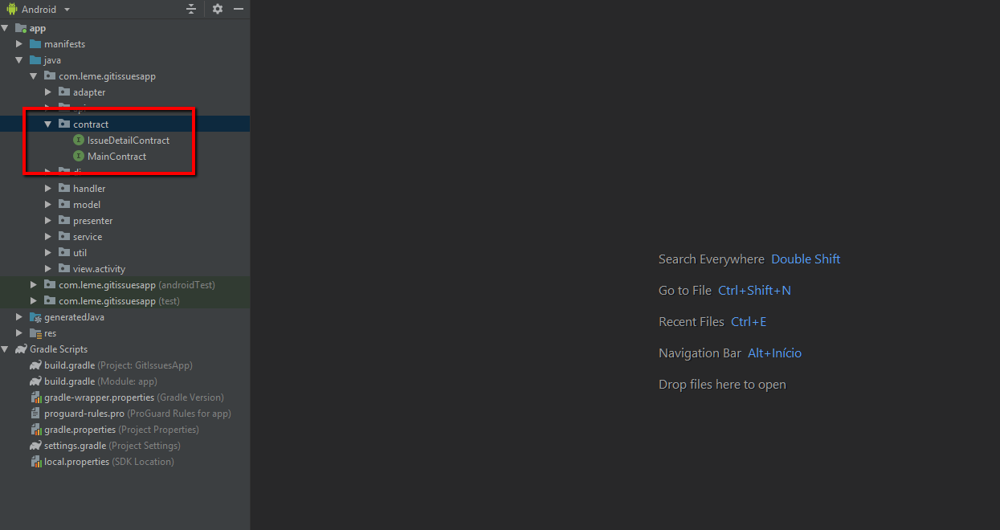
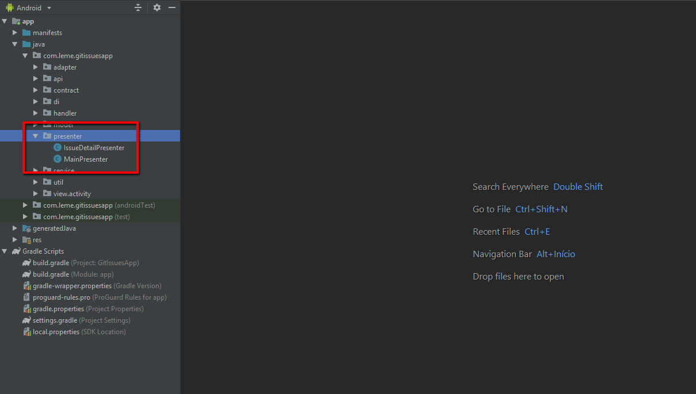
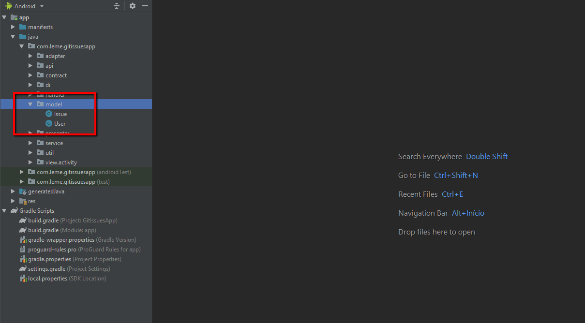
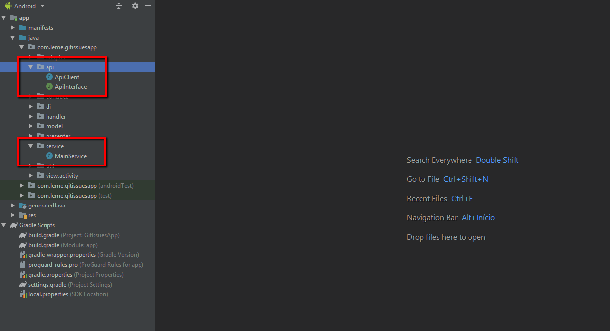
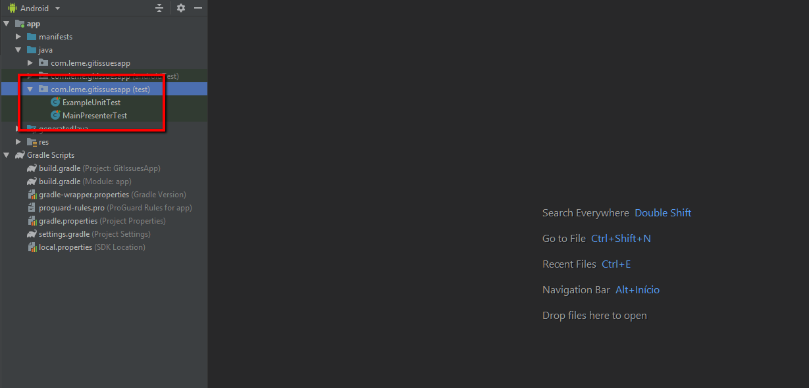
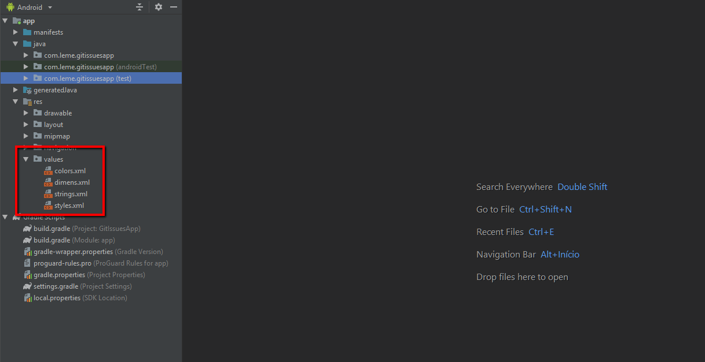
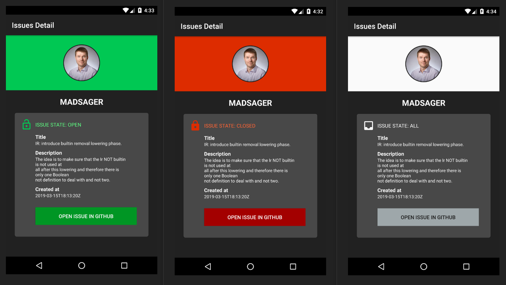

# Jaya Test

Projeto foi feito pensando em reutilização de código, separação de responsabilidade, organização e código limpo focando na arquitetura MVP.

## Principais Frameworks

- Butterknife
- Retrofit2
- Gson
- Picasso
- Mockito

# Entendendo o Projeto

Esse projeto utiliza o conceito MVP (Model View Presenter), temos a camada da **View** que se comunica com o **Presenter** no qual se comunica com o **Service** para obter os dados e assim retornando-os formatador para a **View**.

# APP

* Telas - **View** responsável por mostrar informações ao usuário como **Activity**.

* Contract - **Interface** responsável por garantir o **contrato entre o Presenter, View e Model**.

* Presenter - responsável por fazer a comunicação entre a **View** e o **Model**.

* Model - responsável por representar os dados de um Objeto para as **View**.

* API e Service - responsáveis garantir o contrato da API consultada e obter os dados para o **Presenter**.

* Testes unitários - responsáveis testar os métodos da **View** chamados pelo **Presenter**.

# RES

* Dimens e Styles - xmls criados pensando em reusabilidade para criação de layout para diferentes tamanhos de telas e orientações.

# Telas de detalhe

* A tela de detalhe muda de acordo com o estado do problema registrado por usuário do Github (teste realizado trocando o estado, "open", "closed" e "all"). 

